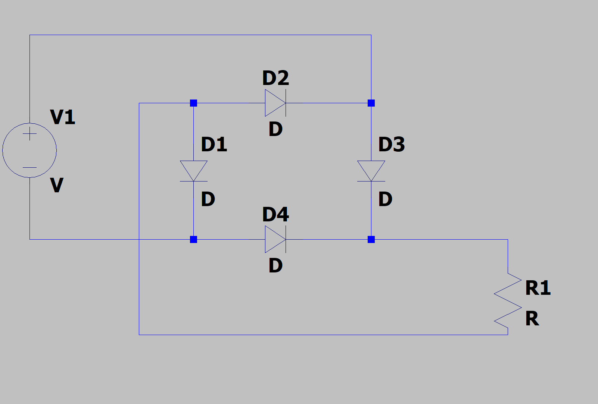
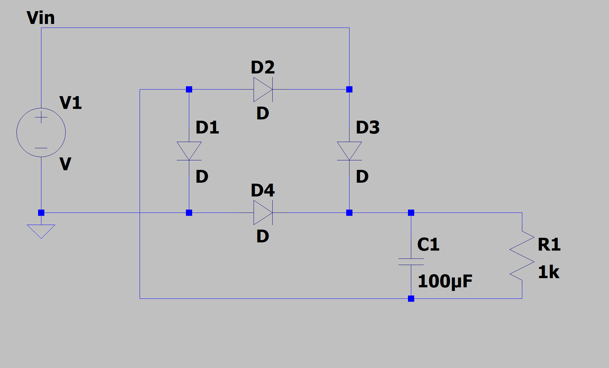
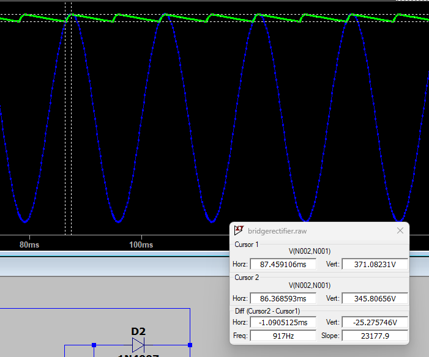
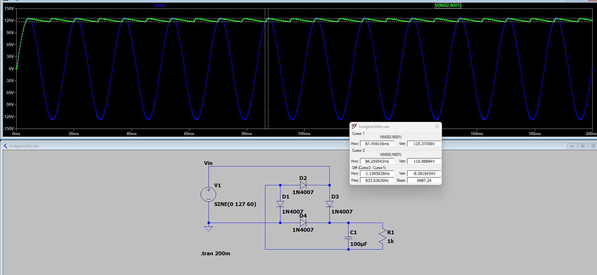
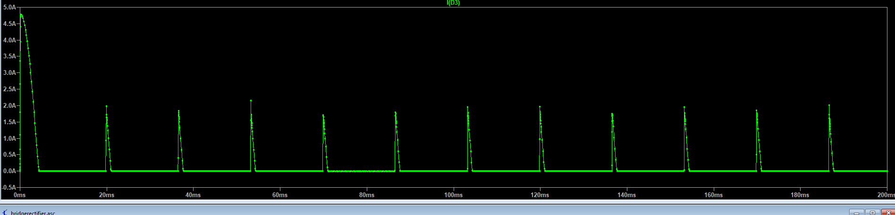
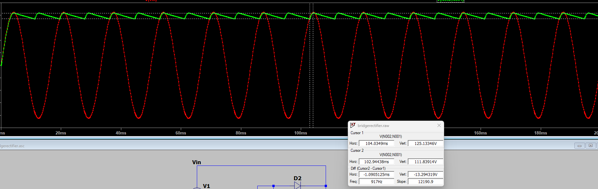

# Front-End Rectifier & Bulk Capacitor Stage — Validation Summary

**Design spec:** 90–264VAC input, 60Hz, 12V/2A (24W) output, 100kHz switching, 85% efficiency target, ±5% regulation, isolated flyback.

This document summarizes the LTspice simulation work done to validate the AC-DC front-end (bridge rectifier + bulk capacitor) of the flyback supply, prior to designing the flyback transformer/switching stage.

---

## 1. Bridge Rectifier Topology

A full-bridge rectifier (D1–D4) was built and verified to route current through the load in a consistent direction on both AC half-cycles, producing full-wave rectified DC.

A 100µF bulk capacitor (C1) was added across the rectifier output to smooth the pulsating DC into a usable rail with bounded ripple.

---

## 2. Initial Ripple Check — High Line (264VAC), 1kΩ Test Load

First functional test: V1 = SINE(0 373 60) (264VAC peak), 1kΩ test load, C1 = 100µF.

**Result:** ~25.3V ripple (371V → 346V peak-to-peak).

This confirmed the rectifier + cap combination behaves as expected, but represented the *best-case* line condition (most voltage headroom), not the design-critical case.

---

## 3. Ripple Check — Low Line (90VAC), 1kΩ Test Load

Since low line (90VAC → 127V peak) is the worst-case condition for bulk cap sizing, V1 was changed to SINE(0 127 60), still with the 1kΩ test load.

**Result:** ~8.4V ripple (125.4V → 117V).

This value understated the real design ripple, since 1kΩ only drew ~0.127A — below the circuit's actual ~0.222A design current at low line.

---

## 4. Bulk Capacitor Sizing Calculation (Hand Calculation)

Using the spec sheet directly:
- V_peak (low line) = 90V × √2 ≈ 127.3V
- P_in = 24W ÷ 0.85 ≈ 28.2W
- I_avg ≈ 28.2W ÷ 127.3V ≈ 0.222A
- Target ripple budget: ~20V (≈15–20% of V_peak, placeholder pending final controller selection)
- C = I ÷ (2 × f × ΔV) = 0.222 ÷ (2 × 60 × 20) ≈ 92.5µF

**Conclusion:** 100µF (already selected) meets the calculated minimum with margin.

---

## 5. Diode Current Stress Validation

Load resistance was corrected to ≈577Ω (matching the real 0.222A design current at 127V peak), and diode current I(D3) was probed directly.

`.meas` results:

| Quantity | Value | Rating (1N4007) | Margin |
|---|---|---|---|
| Steady-state RMS current | 0.400A | 1A continuous | 2.5× |
| Inrush peak current (0–5ms) | 4.79A | ~30A (8.3ms surge) | ~6× |

**Conclusion:** 1N4007 diodes have adequate margin on both continuous (RMS) and one-time inrush current, based on this simulation.

---

## 6. Final Bulk Capacitor Ripple Validation — Real Load

With the corrected 577Ω load (representing actual 0.222A design current) at worst-case low line (127V peak), C1 = 100µF:

**Result:** ~13.3V ripple (125.1V → 111.8V).

This is below the ~20V design ripple target, confirming 100µF/400V is an adequate bulk capacitor choice for this stage under worst-case (low-line, full-load) conditions.

---

## Summary of Validations Completed

| Item | Status | Notes |
|---|---|---|
| Bridge rectifier topology | ✅ Validated | Full-wave rectification confirmed via simulation |
| Bulk capacitor value (100µF) | ✅ Validated | 13.3V ripple vs. ~20V target at worst-case low line, real load current |
| Diode selection (1N4007) | ✅ Validated | RMS and inrush surge current both within datasheet margins |
| Voltage rating (400–450V for C1, diodes) | ⚠️ Not yet simulated | Sized by hand against 373V peak at high line; recommend confirming against final part datasheets |
| Inrush limiting (NTC/fuse) | ❌ Not yet implemented | Simulation shows ~4.79A unmitigated inrush spike; real circuit should add limiting before board layout |
| Real load behavior (vs. resistive test load) | ⚠️ Approximation | Flyback primary behaves as constant-power, not resistive — real ripple may be somewhat worse than resistor-based tests shown here |

