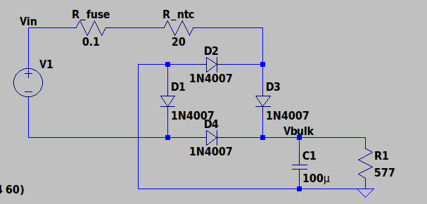
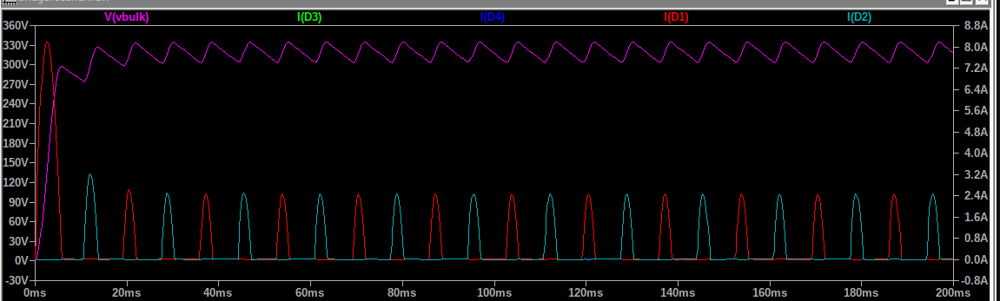

# Front-End Rectifier & Bulk Capacitor Stage — Validation Summary

**Design spec:** 90–264VAC input, 60Hz, 12V/2A (24W) output, 100kHz switching, 85% efficiency target, ±5% regulation, isolated flyback.

This document summarizes the LTspice simulation work validating the AC-DC front-end (bridge rectifier + bulk capacitor + inrush limiting) of the flyback supply, prior to designing the flyback transformer/switching stage.

---

## 1. Rectifier Topology, Bulk Capacitor Sizing, and Diode Selection

A full-bridge rectifier (D1–D4) with a fuse (R_fuse) and NTC-style inrush limiter (R_ntc) ahead of the bridge, feeding a 100µF bulk capacitor (C1), was built and simulated in LTspice.

**Bulk capacitor sizing:**
- V_peak (low line) = 90V × √2 ≈ 127.3V
- P_in = 24W ÷ 0.85 ≈ 28.2W
- I_avg ≈ 28.2W ÷ 127.3V ≈ 0.222A
- Target ripple budget: ~20V (≈15–20% of V_peak, placeholder pending final controller selection)
- C = I ÷ (2 × f × ΔV) = 0.222 ÷ (2 × 60 × 20) ≈ 92.5µF

**Conclusion:** 100µF meets the calculated minimum with margin.

**Diode selection (1N4007):** current was probed at 577Ω load (representing the real 0.222A design current), worst-case low line:

| Quantity | Value | Rating (1N4007) | Margin |
|---|---|---|---|
| Steady-state RMS current | 0.400A | 1A continuous | 2.5× |
| Inrush peak current (0–5ms) | 4.79A | ~30A (8.3ms surge) | ~6× |

**Conclusion:** 1N4007 has adequate margin on both continuous and one-time inrush current, and on voltage (1000V rated vs. 373.4V worst-case peak, ~2.7× margin).

---

## 2. Inrush Limiting (Fuse + NTC)

A fuse (R_fuse = 0.1Ω) and NTC-style inrush limiter (R_ntc = 20Ω) were added ahead of the bridge to reduce the unmitigated inrush spike (baseline: ~14.7A at high line).

Full test matrix (127.3V / 169.7V / 373.4V peak, corresponding to 90/120/264VAC), R_ntc = 20Ω, R1 = 577Ω:

| | 127.3V | 169.7V | 373.4V |
|---|---|---|---|
| Vbulk max | 113.2V | 151.3V | 334.8V |
| Vbulk min (steady-state) | 102.6V | 137.2V | 303.4V |
| Ripple (max − min) | 10.6V | 14.2V | 31.4V |
| Inrush peak | 2.78A | 3.72A | 8.21A |
| Normal input (RMS) | 0.249A | 0.333A | 0.737A |
| Charge time to ~90% | 30.1ms | 30.0ms | 30.0ms |

**Conclusion:** with R_ntc = 20Ω in place, ripple stays well-behaved across the full input range (10.6–31.4V), inrush is reduced from the ~14.7A unmitigated baseline down to 2.78–8.21A depending on line voltage, and RMS diode current stays within 1N4007's rating at every test point.

---

## 3. Physical Build — Deferred

This stage rectifies line voltage directly (up to ~373V peak at high line), which presents a real shock/fire hazard on the bench. Physical build and live testing of this stage will be deferred until appropriate safety equipment (isolation transformer, variac, proper enclosure) is available — all validation to this point has been simulation-only.

---

## Summary of Validations Completed

| Item | Status | Notes |
|---|---|---|
| Bridge rectifier topology | ✅ Validated | Full-wave rectification confirmed via simulation |
| Bulk capacitor value (100µF) | ✅ Validated | 13.3V ripple vs. ~20V target at worst-case low line, real load current |
| Diode selection (1N4007) | ✅ Validated | RMS, inrush surge, and voltage all within datasheet margins |
| Inrush limiting (R_ntc = 20Ω) | ✅ Validated | Ripple and RMS current stay within acceptable range across full input voltage range |
| Voltage rating (400–450V for C1) | ⚠️ Not yet simulated | Sized by hand against 373V peak at high line; confirm against final part datasheet |
| Real load behavior (vs. resistive test load) | ⚠️ Approximation | Flyback primary behaves as constant-power, not resistive — real ripple may be somewhat worse than resistor-based tests shown here |
| Physical hardware build | ⏸ Deferred | Requires isolation transformer/variac for safe mains-connected testing |
